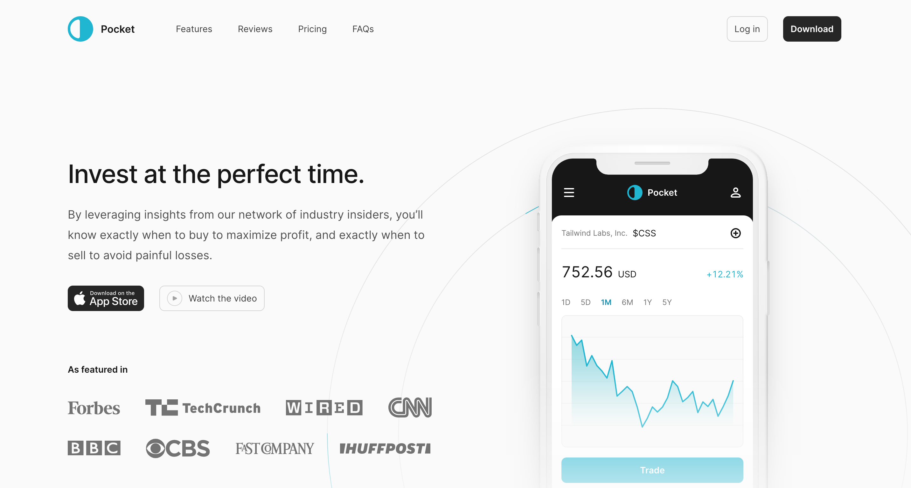

# Pocket App

[](https://pocketapp-beta.vercel.app/)

**Pocket** is a website built with Next.js, designed to help users invest at the perfect time by leveraging insights from a network of industry insiders. This intuitive app provides valuable information to maximize profits and avoid losses by knowing exactly when to buy and sell.

## Features

- **Industry Insider Insights**: Get timely and accurate investment advice from our extensive network of industry experts.
- **Perfect Timing**: Know precisely when to buy to maximize profit and when to sell to avoid losses.
- **User-Friendly Interface**: Inspired by Tailwind UI, the app offers a clean, intuitive, and responsive design.
- **Progressive Web App**: Install the app on your device and use it offline for a seamless experience.

**Invest at the Perfect Time**:
By leveraging insights from our network of industry insiders, you’ll know exactly when to buy to maximize profit, and exactly when to sell to avoid painful losses. Pocket ensures you stay ahead in the investment game with timely and accurate information.

## Getting Started

### Installation

1. **Clone the repository:**

   ```bash
   git clone https://github.com/your-username/pocket.git
   cd pocket
   ```

2. **Install the dependencies:**

   ```bash
   npm install
   ```

3. **Run the development server:**
   ```bash
   npm run dev
   ```
   Open [http://localhost:3000](http://localhost:3000) to view it in the browser. The app will automatically reload if you make edits.

### Contributing

- Fork the repository
- Create a branch
  ```bash
  git checkout -b fix/amazingFix
  ```
- Commit your changes and push to your branch
  ```bash
  git commit -m "made an amazingFix"
  git push origin fix/amazingFix
  ```
- Open a pull request

## License

Distributed under the MIT License. See `LICENSE` for more information.
